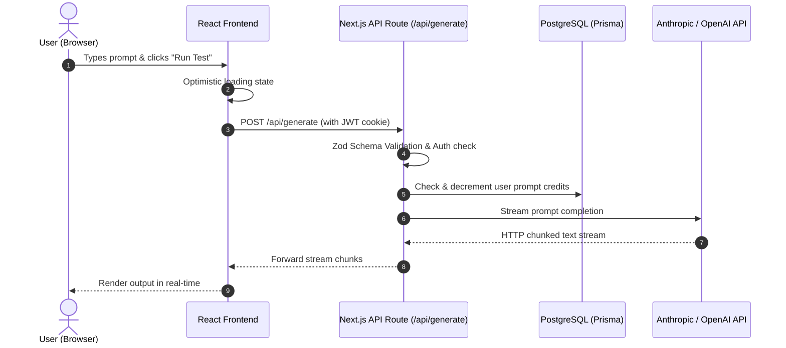

# ⚡ Vibexplain Technical Defense Dossier

> **Project:** PromptStudio AI  
> **Tagline:** Full-Stack AI Prompt Engineering Workbench  
> **Generated:** September 2026  
> **Companion Dashboard:** Open [`vibexplain_sample.html`](./vibexplain_sample.html) in your browser for the interactive visual blueprint.

---

## 1. 🎤 The 60-Second Layman Pitch (EL5)
*Use this when speaking to non-technical angel investors, customers, or friends. Zero confusing jargon.*

- **The Problem:** AI application builders lose track of prompt versions and spend too much time manually testing across OpenAI, Claude, and Gemini in separate browser tabs.
- **The Solution:** PromptStudio gives developers a single collaborative canvas to run side-by-side prompt comparisons with real-time latency and cost metrics.
- **The Secret Sauce (Moat):** A localized edge caching layer that prevents duplicate API requests during prompt iterations, cutting developer LLM bills by up to 40%.
- **Elevator Script (Word-for-Word):**
  > "We built PromptStudio so product teams can test, version, and benchmark AI prompts across all major models in one place — eliminating guesswork and slashing API expenses."

---

## 2. 🏛️ The "Why This Stack?" Matrix
*Why your AI coding assistant chose these tools, and the real-world trade-offs.*

| Technology | Category | Why We Chose It | Trade-off / Limitation |
|---|---|---|---|
| **Next.js 15 (App Router)** | Frontend & Edge API | Unifies React frontend and serverless API endpoints into one directory. App Router enables Server Components for fast page loads. | Cold-start latency on rarely used routes. High vendor affinity with Vercel. |
| **Tailwind CSS + Shadcn UI** | Design System | Utility-first CSS keeps bundle sizes tiny. Shadcn gives copy-paste accessible Radix primitives without npm bloat. | Long class strings in JSX; requires discipline to maintain consistency. |
| **Prisma ORM + PostgreSQL** | Database Layer | End-to-end TypeScript safety and automated migrations. ACID compliance for relational prompt history. | Prisma engine adds ~20MB binary overhead; requires connection pooling in serverless. |
| **NextAuth.js (Auth.js)** | Authentication | Standards-compliant OAuth (Google/GitHub) and encrypted JWT session cookies with zero third-party service fees. | Multi-tenancy and custom session callbacks can be complex to customize. |
| **Vercel AI SDK** | LLM Orchestration | Standardized interface for OpenAI and Anthropic with built-in React UI hooks for real-time text streaming. | Niche provider parameters (e.g. fine-tuning settings) are abstracted away. |
| **Zod Validation** | Runtime Safety | Enforces strict runtime type validation on incoming API requests, preventing malformed payloads from touching the DB. | Adds minor CPU parsing overhead on massive (>10MB) payloads. |

---

## 3. ⚡ Core Request Flow & Architecture

### Request Lifecycle Breakdown:
1. **User Interaction:** User enters a prompt and selects target LLMs. React state sets an optimistic loading skeleton.
2. **Edge Guard:** The request arrives at `/api/generate`. Middleware validates the encrypted JWT session token and Zod parses input length and temperature.
3. **Credit Verification:** Prisma executes an atomic decrement on the user's remaining monthly credits in PostgreSQL.
4. **Model Streaming:** Vercel AI SDK dispatches an async streaming request to Anthropic/OpenAI.
5. **Real-time Pipe:** Text tokens stream directly into the browser DOM via chunked HTTP transfer encoding.

---

## 4. 🃏 The "Investor & Senior Dev Grill" Cheat Sheet

### Q1: What happens if 1,000 users click "Run Test" at the exact same second?
> **Answer:** Our Next.js backend runs on serverless edge functions that auto-scale horizontally to absorb the traffic spike. The primary bottleneck would be PostgreSQL connection limits, which we mitigate using PgBouncer connection pooling, and downstream LLM API rate limits, which are managed with exponential backoff retries.

### Q2: How do you prevent malicious users from hacking your database via SQL Injection?
> **Answer:** We use Prisma ORM, which compiles queries into parameterized SQL statements. User inputs are never directly concatenated into raw SQL strings, making SQL injection virtually impossible.

### Q3: Why didn't you just use Firebase or Supabase directly from the frontend?
> **Answer:** Calling databases directly from the client requires complex Row Level Security (RLS) rules that are prone to misconfiguration. Having a lightweight Next.js API layer gives us centralized Zod validation, secret key protection, and easier future migration options.

### Q4: Are your AI provider secret keys exposed in the frontend bundle?
> **Answer:** No. All provider keys (OpenAI, Anthropic, DB URLs) are stored in server-only environment variables without the `NEXT_PUBLIC_` prefix. Next.js strips them completely from the client-side JavaScript.

---

## 5. ⚠️ Hidden Landmines & Technical Debt

### 🔴 HIGH: Missing Server-Side Rate Limiter (Bill Explosion Risk)
- **File:** `app/api/generate/route.ts`
- **Impact:** A malicious actor could write a simple script calling the API 5,000 times, causing an unexpected spike in your LLM API billing.
- **Fix:** Install `@upstash/ratelimit` and restrict requests to 10 per minute per IP.

### 🟡 MEDIUM: Unindexed Foreign Keys on PromptHistory Table
- **File:** `prisma/schema.prisma`
- **Impact:** As the database grows past 50,000 records, querying history will trigger full table scans, slowing queries from 30ms to 2.5s.
- **Fix:** Add `@@index([userId, createdAt])` to the `PromptHistory` model in `schema.prisma`.

### 🟢 LOW: Client-Side Token Count Estimation
- **File:** `components/prompt-editor.tsx`
- **Impact:** Dividing character length by 4 gives inaccurate token counts for non-English text.
- **Fix:** Use `gpt-tokenizer` on the client for accurate BPE token counts.

---

## 🛡️ Production Hardening Advisory
*Vibe-coded prototypes are incredible for finding product-market fit, but vulnerable to security leaks and bill explosions under heavy traffic.*

> [!IMPORTANT]
> **Need human architectural audit or production hardening?**  
> Connect with senior engineers to audit your auth, database connection pool, and security headers before public launch.  
> 👉 **[Schedule a 30-Minute Architecture Audit](https://github.com/Vibexplain)**

---
*Generated with ⚡ [Vibexplain](https://github.com/Vibexplain) — The Founder Technical Defense System for Vibe Coders.*
